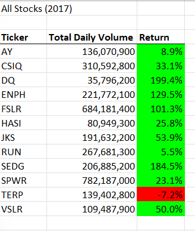
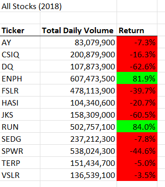

# Stock Analysis Using Excel VBA
## Overview of Project
### Purpose: 
The purpose of this project was to refactor a Microsoft Excel VBA code to collect stock information for the years 2017 and 2018 and to determine if the stocks were worth investing in. The original code would take too long to execute for larger stock datasets. Therefore it was crucial to refactor the code to increase efficiency. 

### Results: 
The steps to refactor the code was listed in a set structure. Included below are the instructions and code used to refactor the VBA code. 

    
    
    
    
```
 '1a) Create a ticker Index
    tickerIndex = 0
    

    '1b) Create three output arrays
    Dim tickerVolumes(12) As Long
    Dim tickerStartingPrices(12) As Single
    Dim tickerEndingPrices(12) As Single
    
    
    ''2a) Create a for loop to initialize the tickerVolumes to zero.
    For i = 0 To 11
        tickerVolumes(i) = 0
        tickerStartingPrices(i) = 0
        tickerEndingPrices(i) = 0
    Next i
    
    

    ''2b) Loop over all the rows in the spreadsheet.
    For i = 2 To RowCount
    
    

        '3a) Increase volume for current ticker
        tickerVolumes(tickerIndex) = tickerVolumes(tickerIndex) + Cells(i, 8).Value
        
        '3b) Check if the current row is the first row with the selected tickerIndex.
        'If Then
        If Cells(i, 1).Value = tickers(tickerIndex) And Cells(i - 1, 1).Value <> tickers(tickerIndex) Then
            tickerStartingPrices(tickerIndex) = Cells(i, 6).Value
        End If
    
            
        'End If
        
        '3c) check if the current row is the last row with the selected ticker
         'If the next row’s ticker doesn’t match, increase the tickerIndex.
        'If  Then
            
        If Cells(i, 1).Value = tickers(tickerIndex) And Cells(i + 1, 1).Value <> tickers(tickerIndex) Then
            tickerEndingPrices(tickerIndex) = Cells(i, 6).Value
        End If
            

            '3d Increase the tickerIndex.
            If Cells(i, 1).Value = tickers(tickerIndex) And Cells(i + 1, 1).Value <> tickers(tickerIndex) Then
                tickerIndex = tickerIndex + 1
            End If
            
            
            
        'End If
    
    Next i
    
    '4) Loop through your arrays to output the Ticker, Total Daily Volume, and Return.
    For i = 0 To 11
        
        Worksheets("All Stocks Analysis").Activate
        Cells(4 + i, 1).Value = tickers(i)
        Cells(4 + i, 2).Value = tickerVolumes(i)
        Cells(4 + i, 3).Value = tickerEndingPrices(i) / tickerStartingPrices(i) - 1
        
        
    Next i
```    
    
    
    After running the macro, the excel should look like the following image for 2017 and 2018, respectively. 



## Summary: 
### What are the advantages or disadvantages of refactoring code? 
The goal of refactoring code is to make code cleaner and more efficient. This is through taking fewer steps, decreasing memory usage, and/or improving the logic of the code. Making code easier to read also benefits other coders who view our projects. One disadvantage of refactoring code is that any time a change is made to code, there is a potential to introduce a bug that your tests won't catch. 

### How do these pros and cons apply to refactoring the original VBA script?
One advantage of refactoring the original VBA script was a decrease in macro run time. The original VBA script took approximately 0.50 seconds to run while the refactored code took approximately 0.125 seconds to run. This shows that the refactored code will be able to run larger stock data sets, which was a concern of the original VBA script. 

